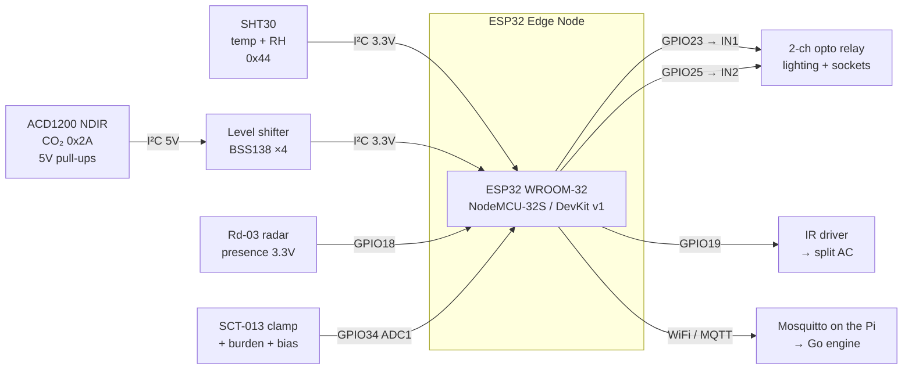

# ECON Edge Node — Wiring Schematic

Every circuit the ESP32 firmware (`edge/esp32/src/main.cpp`) expects. Parts are in
[SHOPPING_LIST.md](SHOPPING_LIST.md).

Nothing here is optional-by-taste: each pin below is compiled into the firmware, and the
three constraints marked ⚠️ will damage hardware or produce silently wrong data if ignored.

---

## Master pin map — ESP32 (WROOM-32)

Every row below is a GPIO **number**, not a header position, so this map is the same on the
30-pin DevKit v1 and on the 38-pin NodeMCU-32S that hshop actually stocks. Only where the
pin physically sits on the board changes.

| GPIO | Direction | Connects to | Build flag | Notes |
|---|---|---|---|---|
| **21** | I²C SDA | SHT30 · ACD1200 (via level shifter) | `USE_SHT30` / `USE_CO2` | Shared bus |
| **22** | I²C SCL | SHT30 · ACD1200 (via level shifter) | `USE_SHT30` / `USE_CO2` | Shared bus |
| **23** | out | Lighting relay IN | *(default)* | Active HIGH |
| **25** | out | Plug relay IN | `USE_PLUG` | Active HIGH, **boots energized** |
| **19** | out | IR emitter driver (transistor base) | `USE_IR_AC` | ⚠️ **must not** move to GPIO22 |
| **18** | in | Rd-03 `OT2` (pin 5) / LD2410C `OUT` | `USE_MMWAVE` | 3.3 V logic — direct, no shifter |
| **5** | in | PIR HC-SR501 OUT | `USE_PIR` | 3.3 V logic |
| **4** | in/out | DHT11/22 data | `USE_DHT` | Fallback only; 10 kΩ pull-up to 3V3 |
| **34** | in (ADC1_CH6) | SCT-013 analog front end | `USE_PLUG` | **Input-only pin.** ADC1 — ADC2 is dead while WiFi is up |
| **32** | in (touch T9) | bare pin or a jumper wire | *(demo default)* | Zero-wiring presence demo |
| **2** | out | Onboard LED | *(always)* | MQTT link status |

### The three that replace an assumption with a measurement

These are **in the firmware now**, each behind its own flag, so a board fitted with one
still reports honestly about the others. They exist because the engine otherwise
substitutes an assumption where a number should be, and each of those assumptions is
load-bearing for something the twin claims. A field is **omitted, never defaulted**, when
its sensor is absent or fails — a fabricated zero on the AC clamp would tell the twin the
compressor is off.

| GPIO | Sensor | Build flag | Publishes | Replaces |
|---|---|---|---|---|
| **26** | DS18B20 in the AC's discharge louvre | `USE_SUPPLY_TEMP` | `supplyC` | The 12 °C constant the cooling regressor is referenced to. 1-Wire, 4.7 kΩ pull-up to 3V3; clear of I²C, the IR pin and both relays |
| **35** | 2nd SCT-013 on the AC's own supply | `USE_AC_CLAMP` | `acW` | The **simulated** VAV flow in the cooling regressor. Input-only and on **ADC1** — ADC2 is dead while WiFi is up. Same burden/bias front end as GPIO34 |
| **21/22** | BH1750 ambient light, `0x23` | `USE_LUX` | `lux` | The static solar multiplier, which has no time-of-day or cloud response. Shares the existing I²C bus, 3.3 V, no shifter |

Wiring any of the three costs nothing if you have not bought it yet: leave the flag at 0
and the node behaves exactly as before.

### ⚠️ Three constraints that are not style preferences

1. **The IR emitter is on GPIO19, never GPIO22.** GPIO22 is the I²C clock. `applyHvacSetpoint()`
   drives the IR pin, so sharing them makes every setpoint command hammer SCL and corrupt
   any SHT30/ACD1200 read in flight. Overriding I²C onto 19, 23 or 25 is a **compile error**,
   not a silent fault.
2. **The ACD1200 needs a level shifter.** Its I²C lines are pulled up to **5 V** internally
   (datasheet §2.2). The ESP32 is not 5 V tolerant, and that pull-up sits on the bus the
   3.3 V SHT30 shares. Wiring it directly can damage both.
3. **The current clamp goes around one conductor.** Around a whole two-core cord, live and
   neutral cancel and you measure ~0 A while everything looks wired correctly.

---

## Overview



---

## 1. Power

```
5 V USB PSU ──┬── ESP32 VIN ──► onboard regulator ──► 3V3 rail
              ├── 2-ch relay board  VCC (5 V)
              └── PIR HC-SR501      VCC (5 V)   [if fitted]

3V3 rail ─────┬── SHT30 VCC
              ├── Rd-03 VCC          (3.0–3.6 V part)
              └── Level shifter LV
5 V   ────────── Level shifter HV + ACD1200 VCC

ALL grounds common — ESP32 GND, relay board, radar, sensors, PSU.
```

**Budget.** The ESP32's onboard regulator supplies roughly 500 mA at 3.3 V. The board itself
peaks near 250 mA on WiFi transmit, so run the 5 V loads (relay coils, PIR) from **VIN, not
3V3**. A node that reboots whenever a relay clicks is almost always this.

> The **Rd-03** is a 3.3 V part throughout, which is one fewer rail to think about. An
> LD2410C, if you have one, wants 5 V but its `OUT` is 3.3 V logic and still feeds GPIO18
> directly.

---

## 2. I²C sensor bus — SHT30 + ACD1200

The one circuit where getting it wrong costs hardware.

```
                    ESP32
                 GPIO21 (SDA) ──┬─────────────────────────┐
                 GPIO22 (SCL) ──┼──┬──────────────────────┼──┐
                                │  │                      │  │
                          ┌─────┴──┴─────┐         ┌──────┴──┴───────┐
                          │    SHT30     │         │ Level shifter   │
                          │  VCC → 3V3   │         │ LV=3V3  HV=5V   │
                          │  GND → GND   │         │ LV1/LV2 ← ESP32 │
                          │  addr 0x44   │         │ HV1/HV2 → ACD   │
                          └──────────────┘         └────────┬────────┘
                                                            │
                                                   ┌────────┴────────┐
                                                   │   ACD1200 NDIR  │
                                                   │  VCC → 5 V      │
                                                   │  GND → GND      │
                                                   │  SDA/SCL ← HV   │
                                                   │  Pin5 (SET)     │
                                                   │   leave FLOATING│
                                                   │  addr 0x2A      │
                                                   └─────────────────┘
```

- **Pin 5 (SET) floating selects I²C.** Pulling it low switches the sensor to 1200-baud
  UART, which this firmware does not speak.
- Most SHT30 and level-shifter breakouts already carry 4.7 kΩ pull-ups. Do not stack three
  sets — if the bus is unreliable, remove the redundant ones.
- **120 s preheat.** The ACD1200 emits garbage until it warms up; the firmware rejects
  anything outside 300–10000 ppm rather than publishing it.
- **24/7 spaces:** build `-DCO2_ABC_OFF=1`. The factory automatic baseline calibration
  re-zeroes weekly against the lowest reading it has seen, assuming the room reaches outdoor
  air. A server room or a 24/7 floor never does, so the sensor drifts low while looking
  perfectly healthy. The firmware switches it to manual mode at boot and **verifies the
  write**, warning loudly if it could not.

---

## 3. IR emitter — real AC control

Until recently the firmware only pulsed this pin; it now sends genuine vendor IR frames
(`-DUSE_IR_AC=1`). That makes the driver circuit necessary rather than decorative: an ESP32
GPIO sources ~12 mA, and an IR LED needs ~100 mA of pulse current to reach across a room.

```
   3V3 ──────────────┐
                     │
                    ┌┴┐  10 Ω  (LED current limit)
                    └┬┘
                     │
                    ─┴─  IR LED 940 nm   (anode → resistor, cathode → collector)
                    ▽
                     │
                     ├──────────── C (collector)
   GPIO19 ──[1 kΩ]── B (base)         2N2222 / S8050 (NPN)
                     ├──────────── E (emitter)
                     │
   GND ──────────────┘
```

- **Aim it at the indoor unit's receiver window.** These are line-of-sight; a few metres,
  or a bounce off a light-coloured ceiling, is usually fine.
- Two LEDs in series (raise the resistor to ~4.7 Ω, or run from 5 V) widen coverage in a
  large room.
- Verify before trusting it: the serial monitor prints
  `[hvac] IR frame sent: COOLIX -> 24.0 C`, and telemetry carries **`acReal:true`**. Without
  `USE_IR_AC` the node publishes `acReal:false` and the twin knows the setpoint reached
  nothing — a setback that saves no energy is never counted as if it had.
- A phone camera sees 940 nm as a faint violet flicker: point the emitter at one to confirm
  it is firing at all.

---

## 4. Relays — lighting and sockets

A single **2-channel** opto-isolated board covers both actuators:

```
   ESP32 GPIO23 ──────► IN1  ┌──────────────────┐  CH1 COM ── mains live in
   ESP32 GPIO25 ──────► IN2  │  2-channel relay │  CH1 NO  ── to luminaire
   5 V (VIN)    ──────► VCC  │  opto-isolated   │
   GND          ──────► GND  │  jumper: HIGH    │  CH2 COM ── mains live in
                             └──────────────────┘  CH2 NO  ── to socket circuit
```

- Both channels are **active HIGH** in firmware. Most of these boards carry a
  **high/low trigger jumper — set it to HIGH.** If your lights come on inverted, that jumper
  is the first thing to check; failing that, invert `setLights()`.
- Wire to **NO** (normally open) so a dead node leaves the circuit in its unpowered state.
- The plug relay is driven HIGH in `setup()` before anything else: **fail-energized**. A
  rebooting node must never dark-kill a live socket, which is how a BMS behaves and how the
  after-hours sweep stays safe.

> ⚠️ **Mains.** 220 V AC kills. Use an enclosed, opto-isolated relay board rated for the
> load, keep mains wiring inside an enclosure, and **have a licensed electrician do the
> mains side.** Bench-test the whole system on a lamp before it goes near a distribution board.

---

## 5. Plug-load metering — SCT-013 analog front end

The ESP32's ADC reads 0–3.3 V and cannot see negative voltage. A CT produces a bipolar AC
signal, so it has to be biased to mid-rail first.

### SCT-013-**000** (100 A : 50 mA, current output) — needs a burden

```
                         3V3 ──┬──[10 kΩ]──┬── 1.65 V bias node
                               │            │
                               │           ═╪═ 0.1 µF
                               │            │
                        GND ───┴──[10 kΩ]──┴──┐
                                              │
   SCT-013 jack  tip  ───┬──────────────────────────────► GPIO34
                         │                    │
                        ┌┴┐ 33 Ω burden       │
                        └┬┘                   │
   SCT-013 jack  sleeve ─┴────────────────────┘
```

Build with `-DUSE_PLUG=1 -DPLUG_CAL_A_PER_V=60.6 -DPLUG_MAINS_V=230`.

> **On the bias capacitor:** OpenEnergyMonitor's reference design specifies 10 µF. A 0.1 µF
> from a stocked ceramic assortment is fine at the ESP32's sampling rate and is what hshop
> actually sells — the firmware's comment still says 10 µF, and either works.
>
> **No 3.5 mm jack needed:** snip the CT's plug and land the two bare leads directly.

### SCT-013-**030** (30 A : 1 V, voltage output) — no burden

Same bias divider, **omit the 33 Ω**. The clamp already outputs a voltage; adding a burden
loads it down and under-reads. Build with `-DPLUG_CAL_A_PER_V=30.0`.

### Clamping it on

```
   Distribution board / socket circuit

        ┌───────────────┐
   L ───┤ ((  CT  ))    ├─── to sockets     ← clamp around the LIVE conductor ONLY
        └───────────────┘
   N ─────────────────────── to sockets     ← NOT through the clamp
   E ─────────────────────── to sockets
```

⚠️ Around both conductors the fields cancel and you read ~0 A. This requires opening the
circuit's enclosure — **electrician territory.**

**Calibrating.** Run a known load (a 100 W lamp, a kettle of known rating), compare `plugW`
in the telemetry against it, and scale `PLUG_CAL_A_PER_V` by the ratio. The firmware floors
readings below 0.10 A to zero — that is the clamp's noise floor, not a real load.

---

## 6. Presence

```
   Rd-03:     VCC → 3V3     GND → GND     OT2 (pin 5) → GPIO18   ← the stocked part
   LD2410C:   VCC → 5 V     GND → GND     OUT → GPIO18           (3.3 V logic out)
   HC-SR501:  VCC → 5 V     GND → GND     OUT → GPIO5
```

The **Ai-Thinker Rd-03** is the one to wire: the entire HLK-LD2410 family (2410B/C/S, 2420,
2450) went out of stock at hshop on 16 Jul 2026 and was still unbuyable when the list was
re-checked on 22 Jul. Both assert "output high when sensing", so the firmware treats them
identically — the Rd-03 is simply a 3.3 V part throughout, which makes it the easier of the
two to wire as well.

> ⚠️ **One occupancy source per zone.** A radar reports presence — 0 or 1. The CV node in
> `ai_modules/branch_a_occupancy` reports a head *count* on the same `econ/telemetry/<topic>`
> contract. `IngestTelemetry` takes whichever arrives last and does not arbitrate by source,
> so pointing a camera and a radar at the same zone means the radar's 0/1 overwrites the
> count every 5 seconds — and the per-occupant coefficients the twin identifies (θ₂ in °C/hr
> per person, φ₀ in ppm/hr per person) quietly become per-*room* instead. Pick one per zone:
> the camera where the head count matters, the radar everywhere else.

Neither radar needs a level shifter. Their UART pins are only for tuning gates and
thresholds and are unused here.

If both a PIR and a radar are fitted the firmware **OR**s them. They fail in opposite
directions — the PIR misses someone sitting still, the radar can hold on residual motion
after an exit — and OR-ing errs toward "occupied", which for HVAC is the safe error: a few
minutes of extra cooling, never a dark room with someone in it.

**Zero-wiring demo:** with no presence sensor compiled in, seat a jumper wire in **GPIO32**
and pinch it. The firmware calibrates the untouched baseline at boot and uses hysteresis
plus three agreeing samples, so the reading does not flap.

---

## 7. Per-board identity — flashing more than one node

Each board must publish to its own topic, or two nodes will interleave telemetry into one
zone and fight over its commands:

```ini
; platformio.ini — one board per zone
build_flags =
  -DZONE_TOPIC_OVERRIDE=\"zone_2\"
  -DZONE_LABEL_OVERRIDE=\"Level 5 East\"
  -DUSE_SHT30=1 -DUSE_MMWAVE=1 -DUSE_IR_AC=1 -DIR_AC_PROTOCOL=COOLIX
```

> Set these in **`platformio.ini`**, not via `PLATFORMIO_BUILD_FLAGS`, when a label contains
> spaces — the shell splits the environment variable and the build fails with
> `missing terminating " character`.

Confirm it took, before flashing a floor's worth:

```bash
python3 -m platformio run -e esp32dev && strings .pio/build/esp32dev/firmware.elf | grep zone_2
```

---

## 8. Field wiring — when the node stops being one box

Everything above this line assumes a breadboard, and that is the assumption that breaks
first in a real room. Installed, the node is **four locations**: the sensor belongs on a wall
in the breathing zone, the IR emitter needs line of sight to the indoor unit, the lighting
switch belongs in the luminaire's junction box, and the CT belongs at the distribution
board. **I²C does not span that.** It is a board-level bus — no differential pair, no
shielding, no recovery beyond a NAK. Run the SHT30 down a 4 m cable into a ceiling
controller and it will return plausible numbers that are wrong, which is the failure mode
the rest of this system exists to refuse.

### Split the node, not the bus

Put a sensor head on the wall and a controller at the plant, and let them publish
separately. The engine already supports this and needs no change: `IngestTelemetry` guards
**every** field behind a nil check and gives each its own arrival timestamp, so two boards
on the same zone — one sending temperature and CO₂, the other `acReal` and `plugW` — merge
rather than overwrite.

```
   WALL 1.1–1.5 m AFFL            ENCLOSURE (DIN, IP54)          PLANT
   ┌──────────────────┐           ┌──────────────────┐           ┌──────────────────┐
   │ SENSOR HEAD      │  WiFi or  │ ROOM CONTROLLER  │  ELV      │ AC indoor unit   │
   │ Pico W           │  RS-485   │ ESP32            │  field    │ Lighting JB      │
   │ SHT30 · ACD1200  │ ────────► │ + W5500 + PSU    │ ────────► │ Distribution bd. │
   │ I²C stays inside │           │ numbered terms   │           │                  │
   └──────────────────┘           └──────────────────┘           └──────────────────┘
              publishes temp + CO₂        publishes acReal + plugW
```

This only works with a **Pico W**. A plain Pico depends on `bridge.py` tailing a USB cable —
a bench arrangement, not an installation.

### Cable schedule

| Run | Cable | Max | The rule that bites if ignored |
|---|---|---|---|
| Sensor ↔ its own I²C parts | none — same enclosure | **0.3 m** | No differential pair, no retry. Extending this is the most common way to get numbers that look fine and are wrong |
| Sensor head → switch | WiFi, or Cat6 | — | On a guest SSID the node is NAT'd and rate-limited. Ask for a dedicated SSID or VLAN before anything else |
| Controller → switch | Cat6 U/UTP | **100 m** | An Ethernet limit, not a guideline. Beyond it, add a switch |
| Controller → IR emitter | 2-core ELV, 0.5 mm² | **5 m** | The LED is current-driven; a long thin run drops the pulse and shortens range before it fails outright |
| Controller → SSR input | 2-core ELV, 0.5 mm² | **30 m** | Must not share a conduit with the mains it switches — both a code requirement and what keeps the drive clean |
| Controller → CT | **shielded twisted pair** | **10 m** | Earth the shield **at the controller end only**. Both ends makes a loop that injects the exact 50 Hz you are measuring |
| Controller ← 230 V | fused, glanded, in-box | — | Mains terminates inside the enclosure on fused terminals and goes no further. Nothing at 230 V leaves the box on a plug |

### What the firmware still lacks for an install

Not a wiring problem, but it blocks deployment just as hard: no **OTA update** (you cannot
USB-flash forty ceiling boxes), no **TLS or per-node MQTT credentials** (anonymous on 1883),
**identity and calibration baked into the build** rather than stored in NVS, and no **local
fail-safe** for what the relays do when the broker has been unreachable longer than the
watchdog. `gateway.py` covers the engine being down; it does not cover the node being cut
off from the gateway.

---

## 9. Commissioning checklist

Work down this list; each step proves the one below it is worth attempting.

1. **Bare board.** `pio run -t upload && pio device monitor` → joins WiFi, joins MQTT,
   onboard LED (GPIO2) solid. `mosquitto_sub -t 'econ/#' -v` shows telemetry.
2. **Presence.** Pinch GPIO32 (or wave at the radar) → occupancy changes within ~0.2 s and
   the engine logs `[actuate] zone=… -> LIGHTS_ON;SETPOINT=…`.
3. **I²C.** Serial prints `[i2c] bus up on SDA=GPIO21 SCL=GPIO22`. Warm the SHT30 with a
   hand → the dashboard follows within seconds and `tempReal:true`.
4. **CO₂.** Wait out the 120 s preheat, then breathe near the sensor → ppm climbs. Failed
   CRCs are logged and the field is **omitted**, never faked.
5. **IR.** Serial prints `[hvac] IR AC control ACTIVE: COOLIX on GPIO19` at boot and
   `IR frame sent` per command; **the AC's own display changes**. Telemetry: `acReal:true`.
6. **Relays.** `LIGHTS_OFF` clicks relay 1. Power-cycle the node → the plug relay comes back
   **closed**.
7. **Plug metering.** Switch a known load → `plugW` tracks it; calibrate as above.
8. **Failsafe.** Stop the Go engine. `gateway.py` on the Pi takes over and still darkens a
   verified-vacant zone.

---

## Troubleshooting

| Symptom | Cause |
|---|---|
| Node reboots when a relay clicks | Relay coils on 3V3. Move them to VIN (5 V) |
| SHT30 reads fine until a setpoint command, then fails | IR emitter on GPIO22 (the I²C clock). It belongs on GPIO19 |
| CO₂ always omitted | 120 s preheat not elapsed, missing level shifter, or Pin 5 pulled low (UART mode) |
| CO₂ reads plausibly but drifts low over weeks | ABC calibration on in a 24/7 space — build `-DCO2_ABC_OFF=1` |
| `plugW` ≈ 0 with a load running | Clamp around both conductors instead of the live only |
| `plugW` wrong by a constant factor | Wrong `PLUG_CAL_A_PER_V` for the CT variant (60.6 for -000 + burden, 30.0 for -030) |
| AC ignores every setpoint | Wrong `IR_AC_PROTOCOL`; or no driver transistor (range < 1 m); or `acReal:false`, meaning `USE_IR_AC` was never set |
| Lights inverted | Active-LOW relay board |
| Two zones flickering between each other's readings | Both boards flashed with the same `ZONE_TOPIC` |
| Occupancy drops on people sitting still | PIR only — fit the radar |
