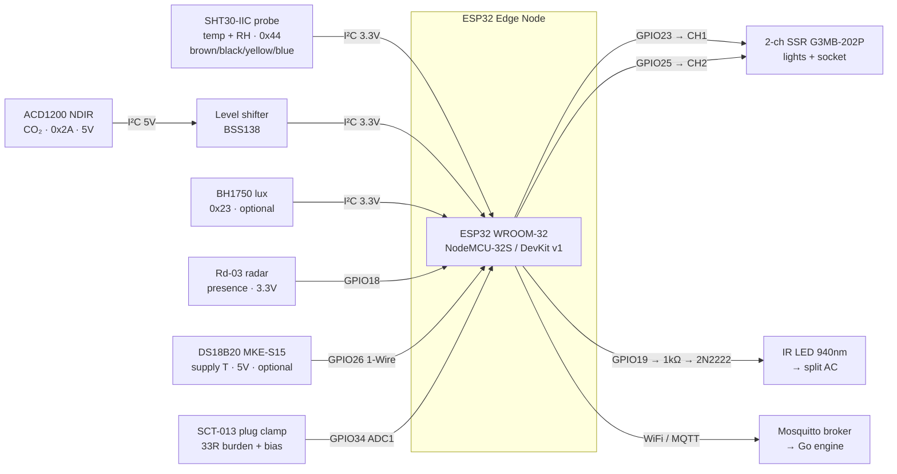

# ECON Edge Node — Wiring Schematic

Every circuit the ESP32 firmware (`edge/esp32/src/main.cpp`) expects. Parts are in
[SHOPPING_LIST.md](SHOPPING_LIST.md).

Nothing here is optional-by-taste: each pin below is compiled into the firmware, and the
three constraints marked ⚠️ will damage hardware or produce silently wrong data if ignored.

---

## Master pin map — ESP32 (WROOM-32)

Every row below is a GPIO **number**, not a header position, so this map is the same on the
30-pin DevKit v1 and on the 38-pin NodeMCU-32S that hshop actually stocks. Only where the
pin physically sits on the board changes.

| GPIO | Direction | Connects to | Build flag | Notes |
|---|---|---|---|---|
| **21** | I²C SDA | SHT30 · ACD1200 (via level shifter) | `USE_SHT30` / `USE_CO2` | Shared bus |
| **22** | I²C SCL | SHT30 · ACD1200 (via level shifter) | `USE_SHT30` / `USE_CO2` | Shared bus |
| **23** | out | Lighting relay IN | *(default)* | Active HIGH |
| **25** | out | Plug relay IN | `USE_PLUG` | Active HIGH, **boots energized** |
| **19** | out | IR emitter driver (transistor base) | `USE_IR_AC` | ⚠️ **must not** move to GPIO22 |
| **18** | in | Rd-03 `OT2` (pin 5) / LD2410C `OUT` | `USE_MMWAVE` | 3.3 V logic — direct, no shifter |
| **5** | in | PIR HC-SR501 OUT | `USE_PIR` | 3.3 V logic |
| **4** | in/out | DHT11/22 data | `USE_DHT` | Fallback only; 10 kΩ pull-up to 3V3 |
| **34** | in (ADC1_CH6) | SCT-013 analog front end | `USE_PLUG` | **Input-only pin.** ADC1 — ADC2 is dead while WiFi is up |
| **32** | in (touch T9) | bare pin or a jumper wire | *(demo default)* | Zero-wiring presence demo |
| **2** | out | Onboard LED | *(always)* | MQTT link status |

### The three that replace an assumption with a measurement

These are **in the firmware now**, each behind its own flag, so a board fitted with one
still reports honestly about the others. They exist because the engine otherwise
substitutes an assumption where a number should be, and each of those assumptions is
load-bearing for something the twin claims. A field is **omitted, never defaulted**, when
its sensor is absent or fails — a fabricated zero on the AC clamp would tell the twin the
compressor is off.

| GPIO | Sensor | Build flag | Publishes | Replaces |
|---|---|---|---|---|
| **26** | DS18B20 in the AC's discharge louvre | `USE_SUPPLY_TEMP` | `supplyC` | The 12 °C constant the cooling regressor is referenced to. 1-Wire, 4.7 kΩ pull-up to 3V3; clear of I²C, the IR pin and both relays |
| **35** | 2nd SCT-013 on the AC's own supply | `USE_AC_CLAMP` | `acW` | The **simulated** VAV flow in the cooling regressor. Input-only and on **ADC1** — ADC2 is dead while WiFi is up. Same burden/bias front end as GPIO34 |
| **21/22** | BH1750 ambient light, `0x23` | `USE_LUX` | `lux` | The static solar multiplier, which has no time-of-day or cloud response. Shares the existing I²C bus, 3.3 V, no shifter |

Wiring any of the three costs nothing if you have not bought it yet: leave the flag at 0
and the node behaves exactly as before.

### ⚠️ Three constraints that are not style preferences

1. **The IR emitter is on GPIO19, never GPIO22.** GPIO22 is the I²C clock. `applyHvacSetpoint()`
   drives the IR pin, so sharing them makes every setpoint command hammer SCL and corrupt
   any SHT30/ACD1200 read in flight. Overriding I²C onto 19, 23 or 25 is a **compile error**,
   not a silent fault.
2. **The ACD1200 needs a level shifter.** Its I²C lines are pulled up to **5 V** internally
   (datasheet §2.2). The ESP32 is not 5 V tolerant, and that pull-up sits on the bus the
   3.3 V SHT30 shares. Wiring it directly can damage both.
3. **The current clamp goes around one conductor.** Around a whole two-core cord, live and
   neutral cancel and you measure ~0 A while everything looks wired correctly.

---

## Overview


```mermaid
flowchart LR
  subgraph N["ESP32 Edge Node"]
    E["ESP32 WROOM-32<br/>NodeMCU-32S / DevKit v1"]
  end
  SHT["SHT30-IIC probe<br/>temp + RH · 0x44<br/>brown/black/yellow/blue"] -- "I²C 3.3V" --> E
  LS["Level shifter<br/>BSS138"] -- "I²C 3.3V" --> E
  CO2["ACD1200 NDIR<br/>CO₂ · 0x2A · 5V"] -- "I²C 5V" --> LS
  LUX["BH1750 lux<br/>0x23 · optional"] -- "I²C 3.3V" --> E
  RAD["Rd-03 radar<br/>presence · 3.3V"] -- "GPIO18" --> E
  DS["DS18B20 MKE-S15<br/>supply T · 5V · optional"] -- "GPIO26 1-Wire" --> E
  CT["SCT-013 plug clamp<br/>33R burden + bias"] -- "GPIO34 ADC1" --> E
  E -- "GPIO23 → CH1" --> SSR["2-ch SSR G3MB-202P<br/>lights + socket"]
  E -- "GPIO25 → CH2" --> SSR
  E -- "GPIO19 → 1kΩ → 2N2222" --> IR["IR LED 940nm<br/>→ split AC"]
  E -- "WiFi / MQTT" --> BR["Mosquitto broker<br/>→ Go engine"]
```

---

## Master schematic — the whole node on one page

Build D, everything fitted. The mermaid diagram above shows *what talks to what*; this shows
*what is physically connected to what*, which is the thing you wire from. `[flag]` marks a
device that is only present when that build flag is set.

```
 ╔═══════════════════════════════════════════════════════════════════════════════════╗
 ║  POWER TREE                                                                       ║
 ╚═══════════════════════════════════════════════════════════════════════════════════╝

    5 V 2 A USB PSU
      │ +5V                                                            │ GND
      ▼                                                                ▼
 ═══╦═╩═══════╦══════════════╦═══════════════╦════════════ 5V RAIL   ══╧══ GND RAIL ══╗
    ║         ║              ║               ║                                        ║
 ESP32 VIN  SSR DC+   shifter AVCC    ACD1200 VCC [USE_CO2]  DS18B20 (MKE-S15)                           ║
    ║                                  (+ PIR VCC [USE_PIR])                          ║
    ▼                                                                                 ║
 ┌──────────┐   the narrow part of the whole design — see the budget in §1             ║
 │ AMS1117  │   ~500 mA usable, and the ESP32 itself takes half of it                  ║
 │  → 3.3 V │                                                                          ║
 └────┬─────┘                                                                          ║
      ▼                                                                                ║
 ═══╦═╩═══╦═══════╦═══════════╦═══════════╦═══════════╦═══════════ 3V3 RAIL           ║
    ║     ║       ║           ║           ║           ║                                ║
  SHT30 Rd-03  BH1750    shifter BVCC   R4 (bias)   R2 → IR LED anode                  ║
   VCC   VCC    VCC          VCC                      R6, R7 pull-ups                  ║
    ║     ║       ║           ║           ║           ║           ║                    ║
    ╚═════╩═══════╩═══════════╩═══════════╩═══════════╩═══════════╩═══ all GND ════════╝
                        ⚠ every ground common, including both breadboard rails

 ╔═══════════════════════════════════════════════════════════════════════════════════╗
 ║  ESP32 WROOM-32  ·  GPIO fan-out                                                  ║
 ╚═══════════════════════════════════════════════════════════════════════════════════╝

   ── I²C bus (3.3 V) ──────────────────────────────────────────────────────────────
   GPIO21 SDA ●──┬── SHT30 SDA (0x44)
                 ├── BH1750 SDA (0x23)          [USE_LUX]
                 └── shifter BSDA ═► ASDA ═► ACD1200 SDA (0x2A, 5 V)   [USE_CO2]
   GPIO22 SCL ●──┬── SHT30 SCL
                 ├── BH1750 SCL                 [USE_LUX]
                 └── shifter BSCL ═► ASCL ═► ACD1200 SCL
                                              ACD1200 pin 5 (SET) ─── FLOATING = I²C

   ── Actuator outputs (active HIGH) ───────────────────────────────────────────────
   GPIO23 ────────────────────► SSR CH1 ──► [A1─B1] in SERIES with LIVE ── luminaire
   GPIO25 ────────────────────► SSR CH2 ──► [A2─B2] in SERIES with LIVE ── socket
          └─ boots HIGH: fail-energized                        [USE_PLUG]

   GPIO19 ──[R1 1k]──► B  2N2222      3V3 ──[R2 10R]──►│IR LED 940nm│──► C
                          E ──► GND                                       [USE_IR_AC]

   ── Sensor inputs ────────────────────────────────────────────────────────────────
   GPIO18 ◄──────────────────── Rd-03 OT2 (pin 5)      3.3 V logic   [USE_MMWAVE]
   GPIO5  ◄──────────────────── PIR HC-SR501 OUT       3.3 V logic   [USE_PIR]
   GPIO26 ◄────┬─────────────── DS18B20 DATA                      [USE_SUPPLY_TEMP]
               └──[R6 4.7k]──► 3V3
   GPIO4  ◄────┬─────────────── DHT11/22 DATA                    [USE_DHT] fallback
               └──[R7 10k]───► 3V3
   GPIO32 ◄──────────────────── bare jumper (touch T9 demo)

   ── Analog front ends (ADC1 only — ADC2 is dead while WiFi is up) ────────────────
                3V3 ──[R4 10k]──┬── 1.65 V bias ──[C1 0.1µ]── GND
                                │
   GPIO34 ◄─────────────────────┼── CT tip     ⎫
                GND ──[R5 10k]──┘              ⎬ R3 33R burden across tip↔sleeve
                                   CT sleeve   ⎭ clamp LIVE conductor ONLY  [USE_PLUG]

   GPIO35 ◄──── identical front end: R3′/R4′/R5′/C1′, 2nd CT on the AC's own supply
                                                                    [USE_AC_CLAMP]
   ── Status ───────────────────────────────────────────────────────────────────────
   GPIO2  ────────────────────► onboard LED = MQTT link state
```

Three things this drawing is trying to make un-missable, each of which has its own section
below: the **level shifter is the only 5 V thing on the I²C bus** (§2), the **SSR output pair
goes in series with live** rather than to a COM/NO contact (§4), and the **bias divider is
what holds GPIO34 at a defined voltage** — those pins have no internal pull-ups (§5).

---

## Bill of connections — every terminal

The full Build D node, device by device, matched to the parts actually bought
([SHOPPING_LIST.md](SHOPPING_LIST.md)). Rails: **5 V** = USB PSU → ESP32 VIN; **3V3** = the
ESP32's onboard regulator; **GND** is common to everything. A build flag in `[brackets]`
means the row is present only with that flag; unflagged rows are always there. Every GPIO is
a **number**, identical on the 30-pin DevKit and the 38-pin NodeMCU-32S.

### ESP32 WROOM-32 (NodeMCU-32S) — every pin used

| ESP32 pin | Dir | Net | Wires to | Flag |
|---|---|---|---|---|
| VIN / 5V | pwr in | 5V | PSU +5 V; SSR DC+; shifter **AVCC**; ACD1200; **DS18B20 (MKE-S15)**; (PIR VCC) | — |
| 3V3 | pwr out | 3V3 | SHT30 (brown), Rd-03, BH1750; shifter **BVCC**; both bias dividers; IR-LED anode via R2 | — |
| GND | pwr | GND | PSU −, SSR DC−, every sensor GND, both bias dividers | — |
| GPIO21 | I²C SDA | SDA | SHT30 SDA (**yellow**) · BH1750 SDA · shifter **BSDA** | `USE_SHT30`/`USE_CO2`/`USE_LUX` |
| GPIO22 | I²C SCL | SCL | SHT30 SCL (**blue**) · BH1750 SCL · shifter **BSCL** | same |
| GPIO23 | out | — | SSR **CH1** (lighting) | *(default)* |
| GPIO25 | out | — | SSR **CH2** (plug socket), boots HIGH | `USE_PLUG` |
| GPIO19 | out | — | **R1 1 kΩ** → 2N2222 base | `USE_IR_AC` |
| GPIO18 | in | — | Rd-03 **OT2** (pin 5) | `USE_MMWAVE` |
| GPIO34 | ADC1 in | — | plug CT tip / bias node (input-only) | `USE_PLUG` |
| GPIO35 | ADC1 in | — | AC-clamp CT tip / bias node (input-only) | `USE_AC_CLAMP` |
| GPIO26 | 1-Wire | — | DS18B20 DATA (+ **R6 4.7 kΩ** to 3V3) | `USE_SUPPLY_TEMP` |
| GPIO4 | in/out | — | DHT22/11 DATA (+ **R7 10 kΩ** to 3V3) | `USE_DHT` (fallback) |
| GPIO5 | in | — | PIR HC-SR501 OUT | `USE_PIR` (optional) |
| GPIO32 | touch T9 | — | bare jumper wire — zero-wiring presence demo | *(demo)* |
| GPIO2 | out | — | onboard LED (MQTT link status) | *(always)* |

> ADC note: GPIO34 and GPIO35 are **input-only** and both on **ADC1** — deliberate, because
> ADC2 is dead whenever WiFi is up. Never move a clamp to an ADC2 pin (0, 2, 4, 12–15, 25–27).

### Sensors & modules — pin by pin

Every row below was checked against the **actual product listing** for the part in the
shopping list, not against a generic datasheet for the chip. Where the module disagrees with
the bare sensor — and three of them do — the module wins, because that is what is in the box.

- **SHT30-IIC** (temp+RH, `0x44`): sold as a metal-tube probe on a **50 cm 4-wire flying
  lead** — there are no header pins. **Wire by colour, not by position** (the cable order is
  GND, VCC, SCL, SDA, which is not the functional order):

  | Wire | Function | Goes to |
  |---|---|---|
  | **Brown** (Nâu) | VCC 2.4–5.5 V | **3V3** ⚠️ not 5 V |
  | **Black** (Đen) | GND | GND |
  | **Yellow** (Vàng) | SDA | GPIO21 |
  | **Blue** (Xanh dương) | SCL | GPIO22 |

  ⚠️ **Power it from 3V3 even though it accepts 5 V.** The module has **built-in 10 kΩ
  pull-ups and a filter cap**, and pull-ups go to whatever VCC you give it — on 5 V it drags
  SDA/SCL to 5 V into an ESP32 that is not 5 V tolerant. The wide 2.4–5.5 V input is what
  makes this an easy and expensive mistake. Those built-in pull-ups also mean **do not add
  your own**. Response time is **8 s** (τ, 63 %), so a hand-warming test climbs over ~10–20 s
  rather than instantly — that is the probe's thermal mass, not a bus fault.
- **ACD1200 NDIR CO₂** (`0x2A`) `[USE_CO2]`: VCC→**5 V** (4.75–5.25 V, tight) · GND→GND ·
  SDA→shifter **ASDA** · SCL→shifter **ASCL** · **Pin 5 (SET) → leave FLOATING** (floating =
  I²C; low = 1200-baud UART, which the firmware doesn't speak). Average draw < 45 mA,
  120 s warm-up, refreshes every 2 s. **Its real range is 400–5000 ppm** — narrower than the
  firmware's 300–10000 ppm sanity window, so the sensor, not the filter, is the limit.
- **BSS138 level shifter** (with ACD1200) — ⚠️ **ships with its headers loose in the bag,
  not soldered.** The board is bare through-holes; two 4-pin strips come with it and must be
  soldered on before it connects to anything. Solder them **pointing down** so the board
  plugs straight into the breadboard — it is 4 pins a side, so it straddles the centre
  channel with the B side in one half and the A side in the other, which saves eight jumper
  wires. **The silkscreen does not say LV/HV**; the two sides are lettered **B (low, 3.3 V)**
  and **A (high, 5 V)**:

  | Low side → ESP32 | High side → ACD1200 |
  |---|---|
  | **BVCC** → 3V3 | **AVCC** → 5 V |
  | **BGND** → GND | **AGND** → GND |
  | **BSDA** → GPIO21 | **ASDA** → ACD1200 SDA |
  | **BSCL** → GPIO22 | **ASCL** → ACD1200 SCL |

  Two BSS138 FETs with their own 10 kΩ pull-ups — two channels, exactly enough for SDA+SCL.
  This is the only thing on the bus that is 5 V: the ACD1200 pulls I²C to 5 V and the ESP32
  is not 5 V tolerant.
- **Rd-03 radar** `[USE_MMWAVE]`: VCC→3.0–3.6 V · GND→GND · **OT2 (pin 5)→GPIO18**. DIP-5,
  on-board antenna, ±60°, up to 5 m. 3.3 V throughout, no shifter; its UART (115200 default)
  is only for tuning gates and is unused here. ⚠️ **Ai-Thinker specify a supply able to
  deliver ≥ 200 mA** — see the power budget in §1, because that figure does not fit
  comfortably on the ESP32's onboard regulator.
- **BH1750 lux** (`0x23`) `[USE_LUX]`: VCC→3V3 (module takes 3.3–5 V; use 3V3 for the same
  pull-up reason as the SHT30) · GND→GND · SDA→GPIO21 · SCL→GPIO22 · ADDR→GND. Returns lux
  directly — no conversion maths. Shares the I²C bus, no shifter.
- **DS18B20 (MKE-S15)** `[USE_SUPPLY_TEMP]`: ⚠️ **this module wants 5 VDC**, not 3V3 — the
  bare DS18B20 chip runs on 3.3 V but the MKE-S15 breakout around it is specified at 5 V,
  with TTL 3.3/5 V signalling, so `DATA→GPIO26` is still safe for the ESP32. Ships with a
  3-pin Domino connector and an XH2.54-to-Dupont cable, 1 m probe lead. The breakout carries
  its own conditioning, so **check for an onboard pull-up before adding R6 4.7 kΩ** —
  MKE S-series boards normally include it. Probe sits in the AC's discharge louvre.
- **PIR HC-SR501** `[USE_PIR]`: VCC→**5 V** (3.8–5 V) · GND→GND · OUT→GPIO5 (3.3 V logic
  out, no shifter). Draws **≤ 50 µA** — negligible, not the tens of mA often assumed. 360°
  cone, up to 6 m, with on-board trim pots for hold time and sensitivity.
- **SCT-013 / STC013 100 A** `[USE_PLUG]`: split core, **max conductor diameter 13 mm**,
  1.5 m lead, terminated in a **3.5 mm TRS jack**. The listing does not state the variant,
  but **the body is printed `100A/50mA`** — that is the `-000`, the current-output part, so
  **the burden is required**. (A `-030` would read `30A/1V`.) Still worth confirming there is
  no burden already inside: measure across the leads with nothing clamped — open circuit
  means fit R3 as drawn, a few tens of ohms means one is fitted and you should **omit R3**.
  - **The jack:** snip it off, but do **not** land the bare stranded leads in a breadboard —
    join them to solid-core jumper with a CH-2 spring clamp instead (see §5, "Terminating the
    CT"). If you would rather keep the clamp detachable, a PJ-3F07 or PJ-313 3.5 mm socket is
    2.000₫ at caka, though neither is on 2.54 mm pitch so it wants its own scrap of perfboard.
    Either way **meter which contacts are live first** — usually tip and sleeve with the ring
    unused, but confirm rather than assume, because a silent wrong contact reads as a dead clamp.

### Actuator — SSR G3MB-202P (HS0996)

- **Input (low-voltage → ESP32):** DC+→**5 V** · DC−→GND · CH1←GPIO23 · CH2←GPIO25. Inputs are **TTL 3.3–5 V, high-level** — driven directly, no shifter, no transistor.
- **Output (mains, each pair in SERIES with LIVE):** A1–B1 → live ↔ luminaire; A2–B2 → live ↔ socket. **No COM/NO/NC.** Neutral stays common to both loads. Full detail and the 0.1–2 A / AC-only caveats are in [§4 Option B](#4-relays--lighting-and-sockets).

### IR AC driver `[USE_IR_AC]`

```
   GPIO19 ──[ R1 1 kΩ ]──► B (base)
                                2N2222 (NPN, TO-92)
   3V3 ──[ R2 10 Ω ]──►|IR LED 940nm|──► C (collector)
                        (anode)  (cathode)
   GND ───────────────────────────────► E (emitter)
```

IR LED is the caka **"Led Phát"** 940 nm emitter (buy 2 to widen coverage; if in series, raise R2 to ~4.7 Ω or drive from 5 V). Aim at the indoor unit's receiver window.

### Plug CT front end — SCT-013-000 `[USE_PLUG]`

```
   3V3 ──[ R4 10 kΩ ]──┬── bias node (≈1.65 V) ──[ R5 10 kΩ ]── GND
                       │
                       ├──[ C1 0.1 µF ]── GND
                       │
   CT sleeve ──────────┘
   CT tip ─────────────────────────────────────────► GPIO34
   R3 33 Ω burden ─── across CT tip ↔ CT sleeve
```

Clamp around the **live conductor only**. Build `-DUSE_PLUG=1 -DPLUG_CAL_A_PER_V=60.6 -DPLUG_MAINS_V=230`. For the **SCT-013-030** (1 V voltage-output) variant, **omit R3** and build `-DPLUG_CAL_A_PER_V=30.0`.

### AC-clamp front end — 2nd SCT-013 `[USE_AC_CLAMP]`

Electrically **identical** to the plug front end but read on **GPIO35**, with its own copies: R3′ 33 Ω, R4′/R5′ 10 kΩ, C1′ 0.1 µF. Clamp around the AC indoor unit's own supply live.

> ⚠️ **The two channels default to different mains voltages.** `PLUG_MAINS_V` is **230.0**
> and `AC_MAINS_V` is **220.0** in the firmware. Both are defensible for Vietnam (nominal is
> 220 V, and 230 V is the common regional figure), but the mismatch means `plugW` and `acW`
> are scaled ~4.5 % apart from the same measured amps. If you are comparing the two figures
> against each other, pin them to the same value explicitly:
> `-DPLUG_MAINS_V=220 -DAC_MAINS_V=220`. Better still, measure the socket voltage and use
> that — this is a straight multiplier on every watt the node reports.

---

## Passive components — the resistors and capacitor to buy

All resistors **1/4 W** (5 % is fine), from the caka *"Điện Trở Vạch 1/4W"* value list; the
0.1 µF caps come from the hshop ceramic kit. Per node:

| Ref | Value | Qty | Tol. | Where it goes | Purpose | Flag |
|---|---|---|---|---|---|---|
| **R1** | **1 kΩ** | 1 | any | GPIO19 → 2N2222 base | Limits transistor base current | `USE_IR_AC` |
| **R2** | **10 Ω** | 1 | any · **8.2–22 Ω OK** | 3V3 → IR-LED anode | IR-LED current limit (~100 mA pulse) | `USE_IR_AC` |
| **R3** | **33 Ω** | 1 | **1 % preferred** · substitutable | across SCT-013 (plug) | Burden: current → voltage; sets the 60.6 A/V scale | `USE_PLUG` |
| **R4, R5** | **10 kΩ** | 2 | **matched pair** | 3V3–node–GND divider (plug) | 1.65 V ADC mid-rail bias | `USE_PLUG` |
| **C1** | **0.1 µF** | 1 | any | bias node → GND (plug) | Steadies the mid-rail | `USE_PLUG` |
| R6 | 4.7 kΩ | 1 | any | DS18B20 DATA → 3V3 | 1-Wire pull-up | `USE_SUPPLY_TEMP` |
| R3′ | 33 Ω | 1 | as R3 | across 2nd SCT-013 | Burden | `USE_AC_CLAMP` |
| R4′, R5′ | 10 kΩ | 2 | matched pair | 2nd bias divider | mid-rail bias | `USE_AC_CLAMP` |
| C1′ | 0.1 µF | 1 | any | 2nd bias node → GND | Steadies the mid-rail | `USE_AC_CLAMP` |
| R7 | 10 kΩ | 1 | any | DHT DATA → 3V3 | DHT pull-up | `USE_DHT` (fallback) |

**Minimum resistor buy for Build D (plug + IR, no 2nd clamp):**
**1 × 1 kΩ, 1 × 10 Ω, 1 × 33 Ω, 2 × 10 kΩ** — plus one 0.1 µF from the ceramic kit.
Buy each value once (caka sells ~a bag per value at ~3.000₫), which leaves spares. The I²C
and most sensor breakouts already carry their own 4.7 kΩ pull-ups — don't add more.

**Which tolerances actually matter.** Only two rows care:

- **R3, the burden**, sets the entire current scale — a 5 % resistor is a 5 % power error
  before you start. It is still the right part to buy, because the calibration step in §5
  measures the real value out anyway; 1 % just means less to trim.
- **R4/R5 want to match each other**, not to be accurate. They only have to land the node at
  half of *whatever* the rail is; two 5 % resistors from the same bag typically track within
  1 %. Mismatch shifts the bias off centre and costs you headroom on one half-cycle.

Everything else — the base resistor, the pull-ups, the LED limit — is a factor-of-two
decision, not a percentage one. **Out of stock is not a blocker on any row:** see
[§5, "If you cannot get a 33 Ω burden"](#if-you-cannot-get-a-33-ω-burden) for the
substitution table and the `2000 ÷ R` rule.

---

## Physical layout — putting it on a breadboard

The schematics above say what connects to what. This says where to *put* it, which is the
part that decides whether the analog front end works.

### Wire colours — pick a convention and hold it

Not cosmetic. Every mis-wire that damages something on this node is a rail mistake, and a
rail mistake is exactly what a colour convention makes visible from across the desk.

| Colour | Net | Rule |
|---|---|---|
| **Red** | 5 V | Only ever from VIN/PSU. If red touches a 3.3 V part, stop |
| **Orange** | 3V3 | The ESP32's regulator output |
| **Black** | GND | Every ground, no exceptions |
| **Yellow** | I²C SDA | GPIO21 |
| **Green** | I²C SCL | GPIO22 |
| **Blue** | Digital in (sensors → ESP32) | GPIO18, 5, 26, 4 |
| **White** | Digital out (ESP32 → actuators) | GPIO23, 25, 19 |
| **Purple** | Analog (CT tip, bias node) | GPIO34, 35 — keep these short |
| **Brown/Live · Blue/N · G-Y/Earth** | Mains | Vietnamese/IEC convention. Never on the breadboard |

### Board zoning

The ESP32 is wide. A 38-pin NodeMCU-32S straddles the centre channel of a standard
830-point board and leaves only **one usable hole per pin**; a 30-pin DevKit v1 leaves two
or three. Either way, plan on **two breadboards** (or one 830-point plus a half-size), and
run a jumper from each ESP32 pin it into a free column rather than trying to fan out from
that single hole.

```
   ┌─ BOARD 1 ─ digital ────────────────┐   ┌─ BOARD 2 ─ analog + I²C ──────────┐
   │ ░░ 5V rail  ────────────────────── │   │ ░░ 5V rail  ───────────────────── │
   │ ▓▓ GND rail ────────────────────── │   │ ▓▓ GND rail ───────────────────── │
   │                                    │   │                                   │
   │  ┌──────────────┐                  │   │   R4 ┐                            │
   │  │              │  R1 ─ 2N2222     │   │      ├─ bias node ─ C1 ─ GND      │
   │  │    ESP32     │       │          │   │   R5 ┘      │                     │
   │  │  (straddles  │       R2 ─ IRLED │   │             └──► GPIO34  (purple, │
   │  │   the centre │                  │   │   R3 burden across CT leads       │
   │  │   channel)   │  ── SSR ribbon ──┼───┼─► (SSR lives OFF-board, in its    │
   │  │              │     GPIO23/25    │   │    own enclosure — see §4)        │
   │  └──────────────┘                  │   │   SHT30 · BH1750 · shifter        │
   │ ░░ 3V3 rail ────────────────────── │   │ ░░ 3V3 rail ───────────────────── │
   └────────────────────────────────────┘   └───────────────────────────────────┘
        ↑ noisy: switching, IR pulses            ↑ quiet: high-impedance analog
```

**Why the split is not arbitrary.** The bias node is a ~5 kΩ source impedance (two 10 kΩ in
parallel) sitting on a high-input-impedance ADC pin. That is precisely the kind of node that
capacitively picks up a neighbour — and its neighbours here would be an IR driver slamming
100 mA on and off, and an SSR gate line. Keep the CT front end and its purple analog runs on
the far side of the layout from the IR transistor. If you only have one board, put the
analog front end at one end and the IR driver at the other, and run a black ground jumper
between the two ground rails to keep the return path short.

Three placement rules worth following exactly:

1. **Both ground rails jumpered together, and to ESP32 GND.** A breadboard's four rail
   strips are electrically separate. Half of all "the sensor reads nonsense" faults on a
   two-board layout are a missing rail-to-rail ground jumper.
2. **C1 goes physically at the bias node**, not in a tidy row somewhere else. Its whole job
   is to be a low impedance *at that point*; 60 mm of jumper wire in series with it undoes
   most of that.
3. **R3, the burden, goes directly across the CT's two leads**, as close to where they land
   as possible — ideally soldered to the CT leads themselves. Any wire between the CT and its
   burden is an antenna carrying an unterminated signal.

---

## 1. Power

```
5 V USB PSU ──┬── ESP32 VIN ──► onboard regulator ──► 3V3 rail
              ├── 2-ch relay board  VCC (5 V)
              └── PIR HC-SR501      VCC (5 V)   [if fitted]

3V3 rail ─────┬── SHT30 VCC
              ├── Rd-03 VCC          (3.0–3.6 V part)
              └── Level shifter BVCC
5 V   ────────── Level shifter AVCC + ACD1200 VCC + DS18B20 (MKE-S15)

ALL grounds common — ESP32 GND, relay board, radar, sensors, PSU.
```

### Power budget — the actual arithmetic

Two separate questions, and conflating them is what kills nodes: *is the 5 V PSU big
enough* (easy — yes), and *is the ESP32's little onboard regulator big enough* (the one
that actually bites).

**3V3 rail — supplied by the ESP32's onboard AMS1117, budget ≈ 500 mA usable:**

| Load | Current | Note |
|---|---|---|
| ESP32 module itself | **~250 mA** | Peak, during WiFi transmit bursts. Idle is ~40 mA |
| **Rd-03 radar** | **≥ 200 mA** | ⚠️ Ai-Thinker's own figure — see the warning below |
| DS18B20 | — | On the **5 V** rail (MKE-S15 module), not this one |
| SHT30 | ~1.5 mA | Peak while measuring; ~0.2 µA idle |
| BH1750 | ~0.12 mA | |
| 2 × bias dividers | ~0.33 mA | 3.3 V across 20 kΩ, each |
| IR LED pulse | ~100 mA | **Bursty**, tens of ms per command, not continuous |
| **Continuous total** | **≈ 452 mA** | ~90 % of the regulator |
| **Worst-case coincident** | **≈ 552 mA** | WiFi TX *and* an IR burst at once — **over budget** |

> ⚠️ **This is the one budget that does not close, and the Rd-03 is why.** Ai-Thinker
> specify "power supply current ≥ 200 mA" for the Rd-03. Read strictly that is a requirement
> on the *source* — headroom for its transmit peaks rather than a continuous draw, and
> measured averages are commonly well below it — but it is the only figure the manufacturer
> publishes, and designing under it is guessing. Taken at face value, a node with the radar
> **and** the IR emitter fitted asks for ~552 mA from a regulator good for about 500 mA.
>
> **What to do about it, cheapest first:**
> 1. **Test for it.** Build the node, then watch the serial monitor during an IR command with
>    the radar attached. A brownout reboot mid-command is the symptom; if it never happens,
>    the radar's real average is comfortably under spec and you are fine.
> 2. **Give the radar its own regulator.** A ~10.000₫ AMS1117-3.3 module fed from the **5 V**
>    rail takes the radar off the ESP32's regulator entirely and ends the question. Grounds
>    stay common. This is the fix if step 1 shows any instability.
> 3. **Don't fit both on one node.** Radar on one board, IR on another; the engine merges
>    two boards on the same zone (§8) without any change.
>
> The earlier version of this table put the Rd-03 at ~70 mA and concluded the rail had
> comfortable headroom. That figure came from a generic 24 GHz-radar estimate, not from
> Ai-Thinker, and it was wrong to present it as settled.

**5 V rail — supplied by the 5 V 2 A adaptor, budget 2 A:**

| Load | Current |
|---|---|
| ESP32 + everything on its 3V3 rail (drawn through the regulator) | ~552 mA |
| SSR, 2 channels × 20 mA | 40 mA |
| ACD1200 NDIR (manufacturer: average < 45 mA) | ~45 mA |
| DS18B20 MKE-S15 module | ~2 mA |
| PIR HC-SR501, if fitted | **≤ 0.05 mA** |
| Level shifter | negligible |
| **Total** | **≈ 640 mA** |

The adaptor is rated 2 A, but its own listing says to plan on **70 % for continuous use** —
so treat the real budget as **1.4 A**. At ~640 mA the node sits at roughly **46 %** of that,
which is still comfortable.

> ⚠️ **The adaptor terminates in a 5.5 × 2.1 mm DC barrel jack, not a USB plug.** The
> NodeMCU-32S is powered over Micro USB. To run the whole node off this one supply you need a
> **barrel-jack-to-screw-terminal (or pigtail) adapter** — a part not otherwise on the list —
> to land +5 V and GND on the breadboard rails, then feed ESP32 **VIN** from that rail.
> The alternative is powering the ESP32 from Micro USB and the 5 V rail from the adaptor, in
> which case **their grounds must still be tied together** or the SSR trigger has no return
> path and behaves erratically.

> **The rule that follows from the two tables:** every 5 V device hangs off **VIN, never
> 3V3**. Not because the 5 V budget is tight (it isn't) but because the 3V3 budget is — and
> the regulator is the narrow part. A node that reboots whenever a relay clicks or the WiFi
> reconnects is almost always a 5 V load smuggled onto the 3.3 V rail.

> Two more things that make brownouts look like firmware bugs: a **thin or long USB cable**
> drops enough at 500 mA to trip the ESP32's brownout detector, and a **PC USB port** is
> only good for 500 mA total. Bench-test on a proper PSU before blaming the code.

> The **Rd-03** is a 3.3 V part throughout, which is one fewer rail to think about. An
> LD2410C, if you have one, wants 5 V but its `OUT` is 3.3 V logic and still feeds GPIO18
> directly.

---

## 2. I²C sensor bus — SHT30 + ACD1200

The one circuit where getting it wrong costs hardware.

```
                    ESP32
                 GPIO21 (SDA) ──┬─────────────────────────┐
                 GPIO22 (SCL) ──┼──┬──────────────────────┼──┐
                                │  │                      │  │
                          ┌─────┴──┴─────┐         ┌──────┴──┴───────┐
                          │    SHT30     │         │ Level shifter   │
                          │ brown → 3V3  │         │ BVCC=3V3 AVCC=5V│
                          │ black → GND  │         │ BSDA/BSCL ←ESP32│
                          │  addr 0x44   │         │ ASDA/ASCL → ACD │
                          └──────────────┘         └────────┬────────┘
                                                            │
                                                   ┌────────┴────────┐
                                                   │   ACD1200 NDIR  │
                                                   │  VCC → 5 V      │
                                                   │  GND → GND      │
                                                   │  SDA/SCL ← HV   │
                                                   │  Pin5 (SET)     │
                                                   │   leave FLOATING│
                                                   │  addr 0x2A      │
                                                   └─────────────────┘
```

- **Pin 5 (SET) floating selects I²C.** Pulling it low switches the sensor to 1200-baud
  UART, which this firmware does not speak.
- Most SHT30 and level-shifter breakouts already carry 4.7 kΩ pull-ups. Do not stack three
  sets — if the bus is unreliable, remove the redundant ones.
- **120 s preheat.** The ACD1200 emits garbage until it warms up; the firmware rejects
  anything outside 300–10000 ppm rather than publishing it.
- **24/7 spaces:** build `-DCO2_ABC_OFF=1`. The factory automatic baseline calibration
  re-zeroes weekly against the lowest reading it has seen, assuming the room reaches outdoor
  air. A server room or a 24/7 floor never does, so the sensor drifts low while looking
  perfectly healthy. The firmware switches it to manual mode at boot and **verifies the
  write**, warning loudly if it could not.

---

## 3. IR emitter — real AC control

Until recently the firmware only pulsed this pin; it now sends genuine vendor IR frames
(`-DUSE_IR_AC=1`). That makes the driver circuit necessary rather than decorative: an ESP32
GPIO sources ~12 mA, and an IR LED needs ~100 mA of pulse current to reach across a room.

```
   3V3 ──────────────┐
                     │
                    ┌┴┐  10 Ω  (LED current limit)
                    └┬┘
                     │
                    ─┴─  IR LED 940 nm   (anode → resistor, cathode → collector)
                    ▽
                     │
                     ├──────────── C (collector)
   GPIO19 ──[1 kΩ]── B (base)         2N2222 / S8050 (NPN)
                     ├──────────── E (emitter)
                     │
   GND ──────────────┘
```

- **Aim it at the indoor unit's receiver window.** These are line-of-sight; a few metres,
  or a bounce off a light-coloured ceiling, is usually fine.
- Two LEDs in series (raise the resistor to ~4.7 Ω, or run from 5 V) widen coverage in a
  large room.
- Verify before trusting it: the serial monitor prints
  `[hvac] IR frame sent: COOLIX -> 24.0 C`, and telemetry carries **`acReal:true`**. Without
  `USE_IR_AC` the node publishes `acReal:false` and the twin knows the setpoint reached
  nothing — a setback that saves no energy is never counted as if it had.
- A phone camera sees 940 nm as a faint violet flicker: point the emitter at one to confirm
  it is firing at all.

---

## 4. Relays — lighting and sockets

A single **2-channel** board covers both actuators — the lighting relay on GPIO23 and the
switchable socket on GPIO25. Both channels are driven **active HIGH** by the firmware
(`setLights()` / `setPlug()`), and the plug channel is driven HIGH in `setup()` before
anything else: **fail-energized**, so a rebooting node never dark-kills a live socket while
powered (how a BMS behaves, and how the after-hours sweep stays safe).

Two board types fit this footprint, and they wire **differently**, so pick your section
below. **Buy the SSR (Option B) — the mechanical 5 VDC boards are out of stock:** `HS0998C`
(the 5 VDC variant of the high/low board) and `HS0997` are both *Hết hàng* at hshop, and the
equivalent at caka is out too, as of 23 Jul 2026.

### Option A — mechanical relay (currently out of stock)

Dry contacts (COM / NO / NC), typically 10 A, and switch **AC or DC**. Restocks under
`HS0998C` — check the 5 VDC variant shows *Còn hàng* before ordering.

```
   ESP32 GPIO23 ──────► IN1  ┌──────────────────┐  CH1 COM ── mains live in
   ESP32 GPIO25 ──────► IN2  │  2-channel relay │  CH1 NO  ── to luminaire
   5 V (VIN)    ──────► VCC  │  opto-isolated   │
   GND          ──────► GND  │  jumper: HIGH    │  CH2 COM ── mains live in
                             └──────────────────┘  CH2 NO  ── to socket circuit
```

- Set the board's **high/low trigger jumper to HIGH**. If lights come on inverted, that
  jumper is the first thing to check; failing that, invert `setLights()`.
- Wire to **NO** (normally open) so a dead node leaves the circuit in its unpowered state.

### Option B — solid-state relay (SSR) — the in-stock choice ✅

**hshop `HS0996`, 59.000₫, Còn hàng — OMRON G3MB-202P × 2, zero-cross, photo-triac isolated.**
Every spec below was read off the datasheet/listing and checked against this node:

| Spec | Value | Compatible because |
|---|---|---|
| Trigger input | **TTL 3.3–5 VDC** | ESP32 GPIO is 3.3 V — drives CH1/CH2 **directly**, no level shifter, no transistor |
| Trigger polarity | **High-level** ("High Level Trigger") | Matches the firmware's active-HIGH `setLights()`/`setPlug()` — **no inversion needed** |
| Supply (DC+) | **5 VDC**, 20 mA/channel | From **VIN (5 V)**; 40 mA for both is trivial — and with no coil, the "node reboots when the relay clicks" failure (§1) goes away |
| Output | **75–240 VAC, 0.1–2 A, AC only** | 220 VAC lighting + socket are in range. **Cannot switch DC**, nor AC below 75 V |
| Isolation | Photo-triac | Mains side stays optically isolated from the ESP32 — same intent as the opto relay |

```
   INPUT  (→ ESP32)              OUTPUT (mains — each pair in SERIES with the LIVE wire)
   GPIO23 ──► CH1                CH1:  L ──[ A1 ─ B1 ]── luminaire ── N
   GPIO25 ──► CH2                CH2:  L ──[ A2 ─ B2 ]── socket    ── N
   5 V VIN ─► DC+
   GND     ─► DC-                no COM/NO/NC — the pair IS the switch; neutral stays common
```

- **The output pair goes in series with the LIVE conductor and the load** — not a COM/NO
  contact. This is the one wiring change from Option A.
- ⚠️ **0.1 A minimum load.** A small LED lamp (≲ 25 W ≈ 0.1 A at 230 V) can sit *below* the
  triac's holding current: it may switch unreliably or glow faintly when "off" (leakage).
  Drive the lighting channel with a ≥ ~25 W load, or put the SSR on the socket circuit and a
  mechanical relay on the lights once it restocks. This is the SSR's only behavioural
  difference from a dry contact.
- ⚠️ **2 A ceiling (≈ 460 W/channel).** Fine for a lamp or a single desk. A real switchable
  **socket circuit** (a cluster of PCs + monitors) exceeds this — there the SSR **pilots a
  contactor** rather than carrying the load itself (see §8, "Controller → SSR input").
- **Zero-cross switching** suits resistive / lamp / socket loads; do **not** use it on a
  phase-cut dimmer.

> ⚠️ **Mains.** 220 V AC kills. Use an enclosed, isolated relay/SSR board rated for the
> load, keep mains wiring inside an enclosure, and **have a licensed electrician do the
> mains side.** Bench-test the whole system on a lamp before it goes near a distribution board.

---

## 5. Plug-load metering — SCT-013 analog front end

### Where to clamp — decide this before you buy the clamp

> 🚧 **Provisional, pending a survey of the actual floor.** This section is written from
> photographs of one Vietnamese house's electrical layout. It is the current best answer and
> it is likely to change once the floor has been walked properly.
>
> <details><summary><strong>What to capture on the survey pass</strong> — the questions this
> section cannot answer from two photographs</summary>
>
> Answer these and the clamp choice, the node count and the mounting all fall out. Photograph
> **with the power on and hands off**; nothing here requires opening an enclosure.
>
> **At each distribution point**
> 1. Wide shot showing **height and what you'd stand on** to reach it. Working height or ladder?
> 2. Is it a DIN-rail enclosure with a removable cover, or a surface board with fixed boxes?
> 3. How many breakers, and is anything **labelled** (per-room? per-circuit? nothing?)
> 4. Is there a **sub-main** feeding just this floor, separate from the utility meter? This is
>    the single most valuable thing to find — a reachable sub-main is the one place a 100 A
>    clamp earns its keep.
> 5. Conductor **diameter** at any candidate clamp point (the jaw takes 13 mm max).
> 6. Is there a **spare socket within ~1.5 m** of the candidate point? The CT lead is 1.5 m
>    and the node needs 5 V.
>
> **Around the floor**
> 7. Every **wall socket**, and what is plugged into it. This is the plug-load inventory the
>    twin is actually about.
> 8. The **air conditioner**: indoor unit, its socket or hard-wired connection, and whether
>    the outdoor unit's supply is reachable (that is the `acW` clamp).
> 9. Anything on a **zip-cord / extension lead** — those are the easy, safe first clamp.
> 10. Where a node could physically **live**: a shelf, a socket to power it from, WiFi signal.
>
> **Do not** photograph inside the utility meter enclosure, and do not open anything sealed.
> </details>

The reference designs for CT metering assume a modern consumer unit: a DIN-rail enclosure at
chest height with accessible tails you can open a jaw around. **That is not the layout this
system is being built into.** The observed installation is a surface-mounted board above a
doorway at ladder height, carrying the utility kWh meter, an old breaker, and a SINOTIMER
SVP-912 voltage protector, in an open-air/semi-outdoor space, with the conductors running
inside aged enclosures.

Three things follow from that, and only the third is about wiring:

1. **Do not clamp the service main.** Reaching it means opening a utility enclosure at
   height on a ladder. The meter is the utility's property; the tails are unfused upstream
   of everything. Nothing this project measures is worth that.
2. **You almost certainly do not need to.** ECON's plug-load claim is about the end use a
   BMS cannot see — 26.4 % of energy in the Hanoi case study — and that is measured *per
   appliance*, not at the service head. A clamp on one appliance's cord at a wall socket is
   at working height, needs no ladder, opens no enclosure, and is a closer match to what the
   twin actually models.
3. **Split a zip cord, never a whole cable.** A CT must see one conductor. Clamping around
   both live and neutral together reads ≈ 0 A, because the currents cancel — this is the
   single most common first-day failure with a CT and it looks exactly like a dead sensor.
   Separate the two halves of a zip-cord extension lead over a few centimetres (the
   insulation stays intact; you are pulling them apart, not stripping them) and clamp one.

**A 100 A clamp is the wrong instrument for a 60 W fan.** For per-appliance work prefer a
small CT: hshop's 5 A ring transformer (18.000₫, 1000:1, linear to 10 A on a 100 Ω burden)
resolves a single socket far better than a 100 A jaw, and 10 A × 220 V ≈ 2.2 kW is ample
headroom for anything on a domestic outlet. It is a **solid ring**, so the conductor threads
through it rather than clipping around — which is the same zip-cord split you were doing
anyway. Calibration works out at 10 A/V (5 A ÷ 0.5 V), settable at runtime.

Reserve the 100 A split-core clamp for a genuine sub-main, if a survey turns one up that is
reachable safely.

---

The ESP32's ADC reads 0–3.3 V and cannot see negative voltage. A CT produces a bipolar AC
signal, so it has to be biased to mid-rail first.

### SCT-013-**000** (100 A : 50 mA, current output) — needs a burden

```
                         3V3 ──┬──[10 kΩ]──┬── 1.65 V bias node
                               │            │
                               │           ═╪═ 0.1 µF
                               │            │
                        GND ───┴──[10 kΩ]──┴──┐
                                              │
   SCT-013 jack  tip  ───┬──────────────────────────────► GPIO34
                         │                    │
                        ┌┴┐ 33 Ω burden       │
                        └┬┘                   │
   SCT-013 jack  sleeve ─┴────────────────────┘
```

Build with `-DUSE_PLUG=1 -DPLUG_CAL_A_PER_V=60.6 -DPLUG_MAINS_V=230`.

> **You do not have to get the calibration right before flashing.** Those two flags are now
> only the *defaults*: both are settable at runtime over MQTT and persisted to NVS, so the
> figure can be corrected against a reference meter with the board in place.
>
> ```bash
> # 47 Ω burden instead of 33 Ω -> 100 A / (0.05 A × 47 Ω) ≈ 42.6 A/V
> mosquitto_pub -h <broker> -t econ/config/zone_1 -r -m '{"plugCalAPerV":42.6}'
> mosquitto_sub -h <broker> -t 'econ/config/zone_1/state' -C 1   # confirm it took
> ```
>
> Publish it **retained** (`-r`) so the value survives a reflash or a power cut. A value
> outside 1–500 A/V is refused rather than clamped, and the node reports why on `.../state`.
> Each accepted change bumps `cfgRev` in telemetry, which the engine records as a
> `config-change` device event — so the step in `plugW` at that moment is attributable to
> the recalibration and not mistaken for the load changing. Full field list:
> [esp32/platformio.ini](esp32/platformio.ini).

> **On the bias capacitor:** OpenEnergyMonitor's reference design specifies 10 µF. A 0.1 µF
> from a stocked ceramic assortment is fine at the ESP32's sampling rate and is what hshop
> actually sells — the firmware's comment still says 10 µF, and either works.

### ⚠️ Connect the burden BEFORE you clamp — the -000 is a current source

The `-000` is a **current**-output CT with no internal burden. Clamped around a live
conductor with its leads open-circuit, the secondary has nowhere to push its current, the
core drives toward saturation, and a real voltage appears across the open terminals. It can
bite you and it can kill the CT.

So the burden resistor is not a calibration component you add later — it is the part that
makes the clamp safe to have on a wire at all. **Wire the burden across the terminals
first, verify the bias node reads 1.60–1.70 V, and only then open the jaw.** Unclipping the
CT from the conductor before disconnecting anything is the safe teardown order.

The `-030` has an internal burden and does not have this failure mode. It is the safer part
if you can find one — but see the sourcing note below: it does not appear to be stocked in
HCMC, so plan around the `-000`.

### Terminating the CT — do not land bare stranded leads in a breadboard

The CT arrives with a 3.5 mm plug on a 1.5 m stranded lead. The obvious move is to snip the
plug and push the two bare leads into the breadboard. **Don't.** Stranded wire in a
breadboard clip is an unreliable contact, and this project has already paid for that lesson
once: the SHT30 sat at 82.7 % arrival for a whole session, through four wrong diagnoses,
because of bare stranded leads in breadboard clips. On the CT that same intermittency does
not look like a broken sensor — it looks like *the appliance switched off*.

Three options, in the order worth trying:

| Method | Breadboard holes used | Notes |
|---|---|---|
| **CH-2 spring clamp** (wire-to-wire) | **0** | CT stranded lead in one end, solid-core jumper out the other; only the solid jumper enters the breadboard. **Recommended.** 2.000₫ |
| Solder + heat-shrink to solid core | 0 | Best joint, but soldering is what we are avoiding here |
| KF301-2P / KF128-2P screw terminal | 2 | *Fits* — 5.08 mm pitch is exactly 2 hole pitches — but its flat pins are thicker than the 0.6 mm round pins breadboard clips expect and will splay them permanently. Considered and rejected on a bench with only two breadboards. 2.000₫ |

PJ-3F07 / PJ-313 3.5 mm **female** sockets (2.000₫) exist if you would rather keep the CT's
plug intact, but their pin patterns are not 2.54 mm and do not seat cleanly in a breadboard.

### Put the front end on its own mini board

The bias divider, burden and cap belong on a **SYB-170 mini breadboard (6.000₫)**, not on
the main board, with three jumpers back to it — 3V3, GND, GPIO34.

Two reasons. It costs zero space on the main breadboards, which matters more than it sounds:
an ESP32 DevKit v1 is 22.9–25.4 mm between pin rows against a breadboard's 27.9 mm a→j span,
so it leaves one or two free rows on one side and **none** on the other, which is why the
standard bench setup butts two boards together and straddles the seam. And it is better
practice regardless — the bias node is a high-impedance divider that has to hold 1.60–1.70 V,
and keeping it away from the ESP32's switching and the SSR's relay line is how it stays
there. It is also far easier to probe on a board of its own, which is exactly what the
commissioning step asks you to do before the CT goes on.

### SCT-013-**030** (30 A : 1 V, voltage output) — no burden

Same bias divider, **omit the 33 Ω**. The clamp already outputs a voltage; adding a burden
loads it down and under-reads. Build with `-DPLUG_CAL_A_PER_V=30.0`, or set it at runtime
with `{"plugCalAPerV":30.0}` on `econ/config/<zone>` as above.

### ⚠️ The bias divider is not optional

GPIO34 and GPIO35 are **input-only pins with no internal pull-up or pull-down at all** —
that is a silicon limitation of the ESP32's input-only pins, not a configuration choice.
Leave the ADC node floating and it reads drifting noise that *looks* like a small load.
R4/R5 are what hold the pin at a defined 1.65 V; they are the only thing doing so.

Mid-rail also matters for accuracy, not just polarity. The ESP32's SAR ADC is meaningfully
non-linear in the bottom ~150 mV and near the top of its range; biasing to half scale keeps
the whole AC swing in the well-behaved middle.

> **On attenuation:** `readPlugAmps()` converts counts with `v * (3.3 / 4095.0)`, i.e. it
> assumes full-scale ≈ 3.3 V. The firmware sets `analogReadResolution(12)` but never calls
> `analogSetPinAttenuation()`, so this rests on the Arduino-ESP32 default of **11 dB**. If a
> core update ever changes that default, every clamp under-reads by a constant factor —
> which the calibration step below would absorb silently. If you are chasing a constant-factor
> error and the burden is right, this is the second place to look.

### If you cannot get a 33 Ω burden

Expect this. caka was out of both 10 Ω and 33 Ω on the first buy, and **its website cannot
warn you** — the product JSON reports `inventory_management: null` and `available: true` on
all 83 values of the ¼ W strip, so every value shows in stock whether or not it is. hshop
sells no discrete resistors at all. Which SKU to try instead is in
[SHOPPING_LIST §4a](SHOPPING_LIST.md#4a-resistors--which-caka-sku-actually-has-the-values);
the electrical freedom you have is here.

The burden value is **free to choose**; it only has to be told to the firmware. The
SCT-013-000 is 100 A : 50 mA, a **2000:1** turns ratio, so:

```
PLUG_CAL_A_PER_V  =  2000 ÷ R_burden        (33 Ω → 60.6, which is the firmware default)
```

Any of these work — pick one, fit it, and build with the matching flag:

| R burden | `-DPLUG_CAL_A_PER_V=` | Max current before clipping | Resolution (1 LSB) | Verdict |
|---|---|---|---|---|
| 22 Ω | `90.9` | 100 A (CT-limited) | 73 mA | Coarsest; fine, headroom you'll never use |
| 27 Ω | `74.1` | 86 A | 60 mA | Good |
| **33 Ω** | **`60.6`** | **71 A** | **49 mA** | The nominal design value |
| **39 Ω** | **`51.3`** | **60 A** | **41 mA** | ✅ Best common substitute |
| **47 Ω** | **`42.6`** | **50 A** | **34 mA** | ✅ Best resolution; still 3× a 16 A circuit |
| 68 Ω | `29.4` | 34 A | 24 mA | Only if the circuit is ≤ 20 A |
| 100 Ω | `20.0` | 23 A | 16 mA | Single desk / single appliance only |

Read the trade-off straight down the table: **a bigger burden buys resolution and spends
headroom.** A typical switchable socket circuit sits behind a 16 A or 20 A MCB, so anything
down to 47 Ω keeps at least 2.5× margin over a fully loaded circuit — which is why 39 Ω and
47 Ω are the two to reach for. Below 22 Ω the resolution starts to approach the firmware's
own 0.10 A noise floor and you gain nothing.

**Or build 33 Ω out of what you have:**

| Combination | Actual | `PLUG_CAL_A_PER_V=` |
|---|---|---|
| 3 × 100 Ω in **parallel** | 33.3 Ω | `60.0` — near-exact, the cleanest fix |
| 2 × 68 Ω in **parallel** | 34.0 Ω | `58.8` |
| 2 × 15 Ω in **series** | 30.0 Ω | `66.7` |

Dissipation is negligible either way — 70 mA peak through 33 Ω is ~0.16 W peak, so **1/4 W
is ample**, and a parallel bank splits it further.

> ⚠️ **Never run an SCT-013-000 with no burden at all.** An unloaded current transformer
> with current in the primary develops a large open-circuit voltage across its secondary —
> enough to damage the ADC input. The burden is a safety component, not just a scaling one.
> If you are waiting on a resistor, unclip the CT from the conductor.

**The 10 Ω IR resistor has the same freedom.** R2 sets the LED pulse current:

```
I_pulse  ≈  (3.3 V − V_f(≈1.5 V) − V_ce(sat)(≈0.2 V)) ÷ R2
```

Anything from **8.2 Ω to 22 Ω** (≈195 mA down to ≈73 mA peak) works; 15 Ω lands near 105 mA
and is the easiest substitute to find. The IR carrier is bursty and low duty-cycle, so a
940 nm emitter takes these peaks comfortably. Lower resistance = more range; if the AC
responds at 3 m, you are done, and there is nothing to gain by pushing it.

### Clamping it on

```
   Distribution board / socket circuit

        ┌───────────────┐
   L ───┤ ((  CT  ))    ├─── to sockets     ← clamp around the LIVE conductor ONLY
        └───────────────┘
   N ─────────────────────── to sockets     ← NOT through the clamp
   E ─────────────────────── to sockets
```

⚠️ Around both conductors the fields cancel and you read ~0 A. On a **distribution board**
this means opening the enclosure — **electrician territory.**

#### Bench-testing without an electrician

You do not need a distribution board to prove the front end, and you do not need to expose
a conductor either. Most lamps and small appliances use **zip cord** — the flat figure-8
cable moulded from two conductors joined along a thin web.

```
   zip cord, as supplied            gently pulled apart, ~5 cm
   ┌────────┐                       ┌────────┐
   │ ●    ● │  ← two conductors     │ ●      │ ─── clamp goes around THIS one
   └────────┘    joined by a web    └───┐    │
                                        │ ●  │ ─── the other stays outside
                                    ────┘────┘
```

Separate the two halves by hand for a few centimetres — **without cutting, stripping or
nicking anything**. The insulation is never breached, so nothing conductive is exposed, and
you can clamp one conductor for a genuine measurement under real load. Unplug it while you
separate the cord and while you fit the clamp.

This is the right way to do stage 8 of the bring-up table: a kettle or an incandescent lamp
on a zip cord gives you a known resistive load to calibrate against, with no enclosure
opened and no permit involved. Round sheathed cable (three cores inside an outer jacket)
cannot be split this way — that one really does wait for the distribution board.

### How the firmware turns that voltage into watts

Worth knowing before you calibrate, because it explains both the noise floor and what a
"starved window" means in the logs.

`readPlugAmps()` samples GPIO34 flat out for **100 ms** — about **5 full cycles** at 50 Hz —
then takes the window's **mean as the DC bias** and RMSes the residue around it. Three
consequences:

- **The bias is measured, not assumed.** A divider that sits at 1.6 V instead of 1.65 V costs
  you nothing in accuracy; it only costs headroom. What it cannot tolerate is *drift within
  the window*, which is what C1 is there to prevent.
- **A whole number of cycles matters.** 100 ms is exactly 5 cycles at 50 Hz, so the window
  closes where it opened. On 60 Hz mains it would straddle 6 cycles, adding a small
  ripple — irrelevant here, but the reason the constant is 100 and not, say, 80.
- **Fewer than 100 samples in the window returns −1**, and the field is then **omitted from
  telemetry rather than sent as zero**. This is the "never fabricate a measurement" rule in
  its most literal form: a fabricated zero on a current clamp tells the twin the load is off.

The 0.10 A floor is roughly **2 ADC counts** at the default 33 Ω burden — genuinely the
clamp's noise floor, not a design choice you should tune out. Below it, the reading is
indistinguishable from the bias node's own jitter.

**Calibrating.** Run a known load (a 100 W lamp, a kettle of known rating), compare `plugW`
in the telemetry against it, and scale `PLUG_CAL_A_PER_V` by the ratio:

```
PLUG_CAL_A_PER_V_new  =  PLUG_CAL_A_PER_V_old  ×  (true watts ÷ reported plugW)
```

Use a load of at least a few hundred watts — calibrating against a 15 W phone charger sits
too close to the noise floor to mean anything. A resistive load (kettle, incandescent lamp,
heater) is the honest choice: its power factor is ≈1, so nameplate watts really are
volts × amps. Calibrate against a switching supply or a motor and you are measuring apparent
power against its real power, and you will bake that error into the constant.

> **What this step silently absorbs.** Any constant-factor error upstream — a burden that is
> 39 Ω where the build says 33 Ω, a mains voltage that is really 215 V, an ADC attenuation
> default that changed — all land in the same multiplier and all get trimmed out here. That
> is convenient, and it is also why a calibrated node tells you nothing about whether the
> front end is *right*. Get the burden and `PLUG_MAINS_V` correct first, then calibrate to
> trim; do not use calibration to paper over a wrong resistor.

---

## 6. Presence

```
   Rd-03:     VCC → 3V3     GND → GND     OT2 (pin 5) → GPIO18   ← the stocked part
   LD2410C:   VCC → 5 V     GND → GND     OUT → GPIO18           (3.3 V logic out)
   HC-SR501:  VCC → 5 V     GND → GND     OUT → GPIO5
```

The **Ai-Thinker Rd-03** is the one to wire: the entire HLK-LD2410 family (2410B/C/S, 2420,
2450) went out of stock at hshop on 16 Jul 2026 and was still unbuyable when the list was
re-checked on 22 Jul. Both assert "output high when sensing", so the firmware treats them
identically — the Rd-03 is simply a 3.3 V part throughout, which makes it the easier of the
two to wire as well.

> ⚠️ **One occupancy source per zone.** A radar reports presence — 0 or 1. The CV node in
> `ai_modules/branch_a_occupancy` reports a head *count* on the same `econ/telemetry/<topic>`
> contract. `IngestTelemetry` takes whichever arrives last and does not arbitrate by source,
> so pointing a camera and a radar at the same zone means the radar's 0/1 overwrites the
> count every 5 seconds — and the per-occupant coefficients the twin identifies (θ₂ in °C/hr
> per person, φ₀ in ppm/hr per person) quietly become per-*room* instead. Pick one per zone:
> the camera where the head count matters, the radar everywhere else.

Neither radar needs a level shifter. Their UART pins are only for tuning gates and
thresholds and are unused here.

> ⚠️ **Do not compile `USE_MMWAVE` without the radar actually attached.** The firmware sets
> `pinMode(MMWAVE_PIN, INPUT)` — a plain input, with no pull-down. GPIO18 left floating picks
> up ambient noise and crosses the logic threshold at random, so the zone reports occupancy
> that flickers on nothing. Because presence is OR-ed, one floating pin is enough to hold a
> zone permanently "occupied", and the twin will dutifully cool an empty room all night.
> Either wire the sensor, or leave the flag at 0. If you must bench-test with the flag on and
> no sensor, tie GPIO18 to GND through a 10 kΩ resistor.

> The radar needs roughly **30 s after power-up** to settle before its output means anything.
> A node that boots reporting "occupied" in an empty room and clears shortly after is doing
> exactly what it should.

If both a PIR and a radar are fitted the firmware **OR**s them. They fail in opposite
directions — the PIR misses someone sitting still, the radar can hold on residual motion
after an exit — and OR-ing errs toward "occupied", which for HVAC is the safe error: a few
minutes of extra cooling, never a dark room with someone in it.

**Zero-wiring demo:** with no presence sensor compiled in, seat a jumper wire in **GPIO32**
and pinch it. The firmware calibrates the untouched baseline at boot and uses hysteresis
plus three agreeing samples, so the reading does not flap.

---

## 7. Per-board identity — flashing more than one node

Each board must publish to its own topic, or two nodes will interleave telemetry into one
zone and fight over its commands:

```ini
; platformio.ini — one board per zone
build_flags =
  -DZONE_TOPIC_OVERRIDE=\"zone_2\"
  -DZONE_LABEL_OVERRIDE=\"Level 5 East\"
  -DUSE_SHT30=1 -DUSE_MMWAVE=1 -DUSE_IR_AC=1 -DIR_AC_PROTOCOL=COOLIX
```

> Set these in **`platformio.ini`**, not via `PLATFORMIO_BUILD_FLAGS`, when a label contains
> spaces — the shell splits the environment variable and the build fails with
> `missing terminating " character`.

Confirm it took, before flashing a floor's worth:

```bash
python3 -m platformio run -e esp32dev && strings .pio/build/esp32dev/firmware.elf | grep zone_2
```

---

## 8. Field wiring — when the node stops being one box

Everything above this line assumes a breadboard, and that is the assumption that breaks
first in a real room. Installed, the node is **four locations**: the sensor belongs on a wall
in the breathing zone, the IR emitter needs line of sight to the indoor unit, the lighting
switch belongs in the luminaire's junction box, and the CT belongs at the distribution
board. **I²C does not span that.** It is a board-level bus — no differential pair, no
shielding, no recovery beyond a NAK. Run the SHT30 down a 4 m cable into a ceiling
controller and it will return plausible numbers that are wrong, which is the failure mode
the rest of this system exists to refuse.

### Split the node, not the bus

Put a sensor head on the wall and a controller at the plant, and let them publish
separately. The engine already supports this and needs no change: `IngestTelemetry` guards
**every** field behind a nil check and gives each its own arrival timestamp, so two boards
on the same zone — one sending temperature and CO₂, the other `acReal` and `plugW` — merge
rather than overwrite.

```
   WALL 1.1–1.5 m AFFL            ENCLOSURE (DIN, IP54)          PLANT
   ┌──────────────────┐           ┌──────────────────┐           ┌──────────────────┐
   │ SENSOR HEAD      │  WiFi or  │ ROOM CONTROLLER  │  ELV      │ AC indoor unit   │
   │ Pico W           │  RS-485   │ ESP32            │  field    │ Lighting JB      │
   │ SHT30 · ACD1200  │ ────────► │ + W5500 + PSU    │ ────────► │ Distribution bd. │
   │ I²C stays inside │           │ numbered terms   │           │                  │
   └──────────────────┘           └──────────────────┘           └──────────────────┘
              publishes temp + CO₂        publishes acReal + plugW
```

This only works with a **Pico W**. A plain Pico depends on `bridge.py` tailing a USB cable —
a bench arrangement, not an installation.

### Cable schedule

| Run | Cable | Max | The rule that bites if ignored |
|---|---|---|---|
| Sensor ↔ its own I²C parts | none — same enclosure | **0.3 m** | No differential pair, no retry. Extending this is the most common way to get numbers that look fine and are wrong |
| Sensor head → switch | WiFi, or Cat6 | — | On a guest SSID the node is NAT'd and rate-limited. Ask for a dedicated SSID or VLAN before anything else |
| Controller → switch | Cat6 U/UTP | **100 m** | An Ethernet limit, not a guideline. Beyond it, add a switch |
| Controller → IR emitter | 2-core ELV, 0.5 mm² | **5 m** | The LED is current-driven; a long thin run drops the pulse and shortens range before it fails outright |
| Controller → SSR input | 2-core ELV, 0.5 mm² | **30 m** | Must not share a conduit with the mains it switches — both a code requirement and what keeps the drive clean |
| Controller → CT | **shielded twisted pair** | **10 m** | Earth the shield **at the controller end only**. Both ends makes a loop that injects the exact 50 Hz you are measuring |
| Controller ← 230 V | fused, glanded, in-box | — | Mains terminates inside the enclosure on fused terminals and goes no further. Nothing at 230 V leaves the box on a plug |

### What the firmware still lacks for an install

Not a wiring problem, but it blocks deployment just as hard: no **OTA update** (you cannot
USB-flash forty ceiling boxes), no **TLS or per-node MQTT credentials** (anonymous on 1883),
**identity and calibration baked into the build** rather than stored in NVS, and no **local
fail-safe** for what the relays do when the broker has been unreachable longer than the
watchdog. `gateway.py` covers the engine being down; it does not cover the node being cut
off from the gateway.

---

## Bench bring-up — build it in stages that each prove themselves

Wiring the whole node and then powering it once is how you get a dead sensor and no idea
which connection killed it. Build in the order below; each stage is cheap to verify and
nothing downstream is connected until the stage under it reads correctly.

**The one habit that prevents every expensive mistake:** *measure a rail before you plug
anything into it.* A multimeter on the 3V3 rail costs five seconds. The ACD1200, the SHT30
and the ESP32 all die quietly on 5 V where 3.3 V was intended, and they die on first power-up,
before you have any diagnostic to read.

| Stage | Wire up | Verify before continuing |
|---|---|---|
| **0** | ESP32 + USB only | `pio device monitor` → boot banner at 115200. Onboard LED (GPIO2) responds |
| **1** | Power rails only — **no devices yet** | Meter: 5 V rail **4.75–5.25 V**; 3V3 rail **3.20–3.40 V**; rail-to-rail GND continuity beeps |
| **2** | SHT30 → I²C | Serial: `[i2c] bus up on SDA=GPIO21 SCL=GPIO22`. Warm it by hand → temp follows, `tempReal:true` |
| **3** | Level shifter, **then** ACD1200 | Meter LV = 3.3 V and HV = 5 V *before* the ACD1200 goes in. Then wait out 120 s preheat → ppm appears |
| **4** | Rd-03 → GPIO18 | Meter OT2: **0 V** still room, **3.3 V** when you move. Then check occupancy in telemetry |
| **5** | SSR — **low-voltage side only, no mains** | Channel LEDs follow `LIGHTS_ON`/`LIGHTS_OFF`. GPIO23 measures 3.3 V HIGH / 0 V LOW |
| **6** | IR driver | Phone camera sees the LED flicker; serial prints `IR frame sent`; the AC's own display changes |
| **7** | Bias divider — **CT not connected yet** | Meter GPIO34: **1.60–1.70 V**, steady. This is the stage most worth not skipping |
| **8** | CT + burden, clamped on a **known load** | `plugW` tracks the load; calibrate per §5 |
| **9** | Mains side of the SSR | **Electrician.** Enclosure closed, bench-tested on a lamp first |

### Test points — what a working node measures

Meter between the point and GND unless stated. Values are for a node at rest, WiFi up,
nothing actuated.

| Point | Expected | What a wrong reading means |
|---|---|---|
| 5 V rail | 4.75–5.25 V | Below 4.7 V: thin USB cable, or a PC port at its 500 mA limit |
| 3V3 rail | 3.20–3.40 V | Sagging under load: a 5 V device is on the 3V3 rail (§1) |
| **Bias node / GPIO34** | **1.60–1.70 V** | **0 V or drifting** = R4/R5 missing or mis-seated. This is the single most common analog fault |
| Bias node, AC coupled | < 20 mV ripple | Noisy: C1 is too far from the node, or the IR driver is too close (see layout) |
| GPIO23 | 0 V idle → 3.3 V on `LIGHTS_ON` | Never rises: wrong pin, or the flag isn't compiled in |
| GPIO25 | **3.3 V at boot** | 0 V at boot: `USE_PLUG` not set — fail-energized is deliberate (§4) |
| GPIO19 | 0 V idle, pulses on command | Steady 3.3 V: pin stuck; check nothing else drives it |
| SDA / SCL | ~3.3 V idle, both | 0 V: a device is holding the bus, or pull-ups are missing |
| Shifter LV / HV | 3.3 V / 5 V | Swapped is the failure that damages the ESP32 — check before the ACD1200 goes in |
| Rd-03 OT2 | 0 V vacant, 3.3 V occupied | Always 3.3 V: still in its power-on settling window, give it ~30 s |
| DS18B20 DATA | ~3.3 V idle | 0 V: R6 pull-up missing — the bus cannot idle high without it |
| 2N2222 base (through R1) | ~0.7 V while pulsing | 0 V: R1 open, or GPIO19 not driving |

> **Reading the bias node in software.** The firmware never prints raw ADC counts, so if the
> meter says 1.65 V and `plugW` still looks wrong, flash this three-line sketch to see what
> the ADC actually reports. A correct bias reads **≈ 2048** counts (half of 4095):
>
> ```cpp
> void setup(){ Serial.begin(115200); analogReadResolution(12); }
> void loop(){ Serial.println(analogRead(34)); delay(200); }
> ```
>
> Counts near 0 or 4095 mean the pin is floating or railed, not that the load is huge.
> Counts steady near 2048 with a load running means the CT is around both conductors (§5).

---

## 9. Commissioning checklist

Work down this list; each step proves the one below it is worth attempting.

1. **Bare board.** `pio run -t upload && pio device monitor` → joins WiFi, joins MQTT,
   onboard LED (GPIO2) solid. `mosquitto_sub -t 'econ/#' -v` shows telemetry.
2. **Presence.** Pinch GPIO32 (or wave at the radar) → occupancy changes within ~0.2 s and
   the engine logs `[actuate] zone=… -> LIGHTS_ON;SETPOINT=…`.
3. **I²C.** Serial prints `[i2c] bus up on SDA=GPIO21 SCL=GPIO22`. Warm the SHT30 with a
   hand → the dashboard follows within seconds and `tempReal:true`.
4. **CO₂.** Wait out the 120 s preheat, then breathe near the sensor → ppm climbs. Failed
   CRCs are logged and the field is **omitted**, never faked.
5. **IR.** Serial prints `[hvac] IR AC control ACTIVE: COOLIX on GPIO19` at boot and
   `IR frame sent` per command; **the AC's own display changes**. Telemetry: `acReal:true`.
6. **Relays.** `LIGHTS_OFF` clicks relay 1. Power-cycle the node → the plug relay comes back
   **closed**.
7. **Plug metering.** Switch a known load → `plugW` tracks it; calibrate as above.
8. **Failsafe.** Stop the Go engine. `gateway.py` on the Pi takes over and still darkens a
   verified-vacant zone.

---

## Troubleshooting

| Symptom | Cause |
|---|---|
| Node reboots when a relay clicks | Relay coils on 3V3. Move them to VIN (5 V) |
| Node reboots on WiFi connect, or browns out randomly | 3V3 budget exceeded (§1), thin USB cable, or a 500 mA PC port. Try a proper 5 V 2 A PSU first |
| Reboots specifically **during an IR command**, radar fitted | The Rd-03 + IR case in §1 — the two together exceed the onboard regulator. Give the radar its own AMS1117-3.3 off the 5 V rail |
| SHT30 dead on first power-up, or takes the ESP32 with it | Brown wire on 5 V instead of 3V3. Its 10 kΩ pull-ups then drag the bus to 5 V |
| SHT30 responds but temperature lags badly | Expected — the probe's τ is 8 s. Give it 10–20 s |
| SSR triggers erratically when ESP32 is USB-powered and the rail is adaptor-powered | Grounds not tied together. The trigger has no return path (§1) |
| `plugW` reads a plausible but wrong constant multiple | The CT may have an internal burden — measure across its leads (§ "Sensors & modules"); if a few tens of Ω, omit R3 |
| `plugW` jitters with nothing plugged in | Bias node floating — R4/R5 missing or mis-seated. GPIO34/35 have **no internal pull-ups at all**; the divider is the only thing holding the pin |
| `plugW` noisy but roughly right | C1 too far from the bias node, or the analog front end sitting next to the IR driver. See the layout section |
| Occupancy stuck "occupied" in an empty room | `USE_MMWAVE` compiled with no radar attached — GPIO18 floats and self-triggers. Wire it, drop the flag, or pull GPIO18 down through 10 kΩ |
| Occupancy "occupied" for ~30 s after boot, then clears | Expected — the radar's settling window |
| `plugW` and `acW` disagree by ~4.5 % on the same load | `PLUG_MAINS_V` (230) ≠ `AC_MAINS_V` (220). Pin both explicitly |
| Every reading sane but all watts off by one constant factor | Burden resistor is not the value `PLUG_CAL_A_PER_V` was built for — recompute as `2000 ÷ R` (§5) |
| SHT30 reads fine until a setpoint command, then fails | IR emitter on GPIO22 (the I²C clock). It belongs on GPIO19 |
| CO₂ always omitted | 120 s preheat not elapsed, missing level shifter, or Pin 5 pulled low (UART mode) |
| CO₂ reads plausibly but drifts low over weeks | ABC calibration on in a 24/7 space — build `-DCO2_ABC_OFF=1` |
| `plugW` ≈ 0 with a load running | Clamp around both conductors instead of the live only |
| `plugW` wrong by a constant factor | Wrong `PLUG_CAL_A_PER_V` for the CT variant (60.6 for -000 + burden, 30.0 for -030) |
| AC ignores every setpoint | Wrong `IR_AC_PROTOCOL`; or no driver transistor (range < 1 m); or `acReal:false`, meaning `USE_IR_AC` was never set |
| Lights inverted | Active-LOW mechanical board (Option A) — set its jumper to HIGH, or invert `setLights()`. The SSR (Option B) is high-level trigger and never inverts |
| LED lamp flickers or glows when switched "off" | SSR below its **0.1 A minimum** load — use a ≥ 25 W load on that channel, or a mechanical relay for the lights |
| SSR does nothing / no click and no switching | Expected — an SSR is silent (no click). Check the channel LED and that DC+ is on 5 V, not 3V3; and that the load is AC ≥ 75 V, never DC |
| Two zones flickering between each other's readings | Both boards flashed with the same `ZONE_TOPIC` |
| Occupancy drops on people sitting still | PIR only — fit the radar |
